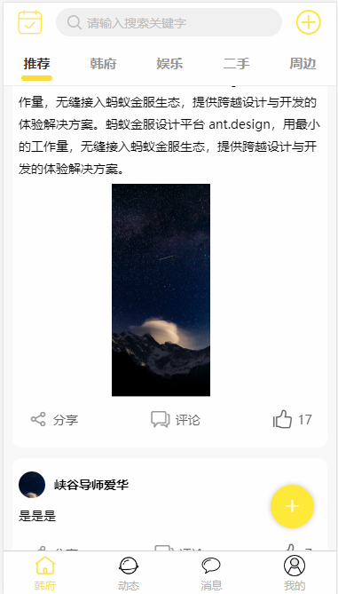

| 简体中文 |

<h1 align="center">HFB APP</h1>

韩府帮社交APP模板。
- 预览：http://mobile.hfb.xquery.cn
- 首页：http://mobile.hfb.xquery.cn
- 使用文档：https://github.com/CNLHB/ssk-hfb
- 更新日志: https://github.com/CNLHB/ssk-hfb
- 常见问题：https://github.com/CNLHB/ssk-hfb/issues

---持续更新---





## 韩府帮第一个版本完成啦！！！ 🎉🎉🎉

[HFB APP](http://mobile.hfb.xquery.cn)

## 模板

```
- index
  - 动态页面
  - 分类展示
- new
  - 关注好友动态
  - 待扩展
- paper
  - 好友列表页面
  - 关注及粉丝页面
  - 搜索好友页面
  - 用户空间
- home
  - 个人详情页
  - 个人信息修改页
- 帐户
  - 登录or三方登录
  - 注册
  - 手机验证码登录
```

## 使用

```bash
$ git clone https://github.com/CNLHB/ssk-hfb.git
# Choose [HFB]
$ 导入目录到HBulider X
$ 运行到浏览器
- Local:   http://localhost:8080/ 
```

更多信息请参考 [使用文档]https://github.com/CNLHB/ssk-hfb)。

## 支持环境

现代浏览器及 IE11。

| [](http://godban.github.io/browsers-support-badges/)</br>IE / Edge | [](http://godban.github.io/browsers-support-badges/)</br>Firefox | [](http://godban.github.io/browsers-support-badges/)</br>Chrome | [](http://godban.github.io/browsers-support-badges/)</br>Safari | [](http://godban.github.io/browsers-support-badges/)</br>Opera |
| --------------------------------------------------------------------------------------------------------------------------------------------------------------------------------------------------------------- | ----------------------------------------------------------------------------------------------------------------------------------------------------------------------------------------------------------------- | ------------------------------------------------------------------------------------------------------------------------------------------------------------------------------------------------------------- | ------------------------------------------------------------------------------------------------------------------------------------------------------------------------------------------------------------- | --------------------------------------------------------------------------------------------------------------------------------------------------------------------------------------------------------- |
| IE11, Edge                                                                                                                                                                                                      | last 2 versions                                                                                                                                                                                                   | last 2 versions                                                                                                                                                                                               | last 2 versions                                                                                                                                                                                               | last 2 versions                                                                                                                                                                                           |

## 参与贡献

我们非常欢迎你的贡献，你可以通过以下方式和我们一起共建 :smiley:：

- 在你的公司或个人项目中使用 。
- 通过 [Issue](https://github.com/CNLHB/ssk-hfb/issues) 报告 bug 或进行咨询。
- 提交 [Pull Request](https://github.com/CNLHB/ssk-hfb/pulls) 改进 代码。
